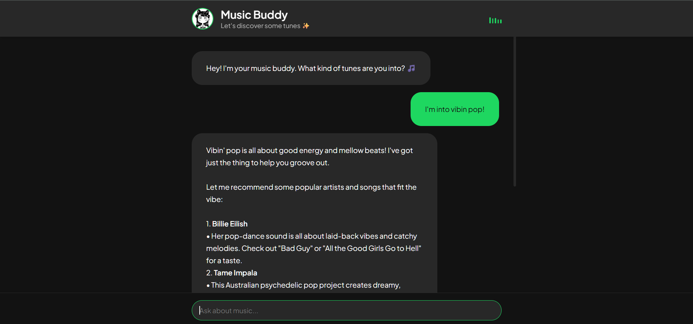

# Music Buddy 🎵



A modern, interactive chat interface that helps you discover music, lyrics, and engage in music-related conversations. Think of it as your personal AI music companion!

## Features

- 🎵 **Music Discovery** - Get personalized music recommendations based on your tastes
- 🎤 **Lyrics Lookup** - Find lyrics for your favorite songs instantly
- 🎥 **Music Video Links** - Get direct YouTube links to music videos
- 💬 **Music Chat** - Have engaging conversations about music, artists, and genres
- 🎨 **Beautiful UI** - Modern, responsive interface with animated elements

## Tech Stack

- **Backend**: Python Flask with streaming responses
- **Frontend**: HTML, CSS, JavaScript
- **APIs**:
  - YouTube Data API for video search
  - Musixmatch API for lyrics
  - Groq AI for natural conversations
  - AZLyrics scraping for additional lyrics data

## Getting Started

1. Clone the repository
2. Install dependencies:
```sh
pip install -r requirements.txt
```

3. Set up your environment variables in `.env`:
```
GROQ_API_KEY="your_groq_api_key"
YOUTUBE_API_KEY="your_youtube_api_key"
MUSIXMATCH_API_KEY="your_musixmatch_api_key"
```

4. Run the application:
```sh
python app.py
```

5. Visit `http://localhost:5000` in your browser

## How to Use

1. **Simple Chat**: Just type your music-related questions or thoughts
2. **Play Music**: Use format "play [song name] by [artist]"
3. **Get Recommendations**: Ask for music suggestions based on your preferences
4. **Music Trivia**: Ask about artists, genres, or music history

## Contributing

Feel free to fork this project and submit pull requests. You can also open issues for bugs or feature requests.

